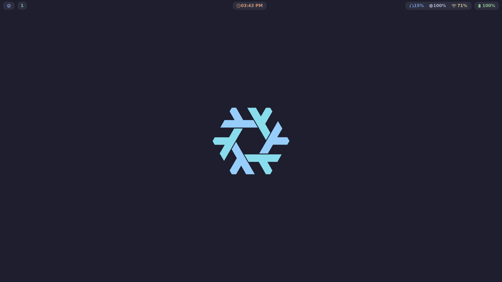
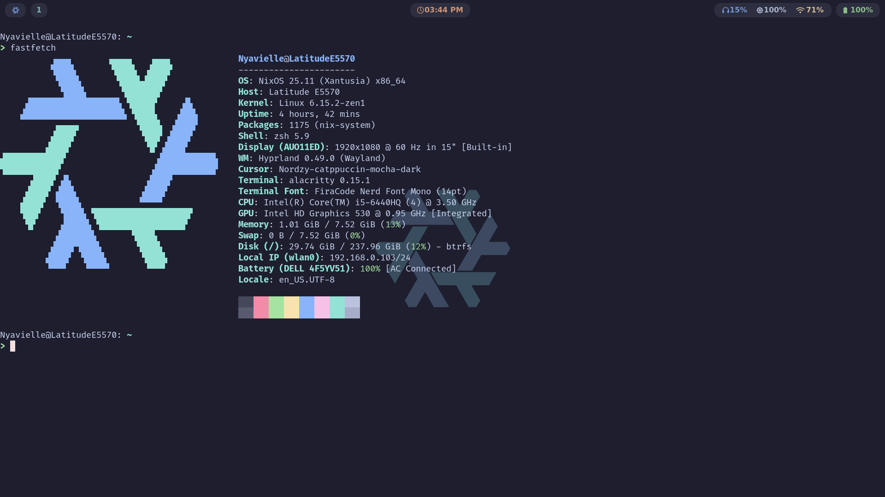
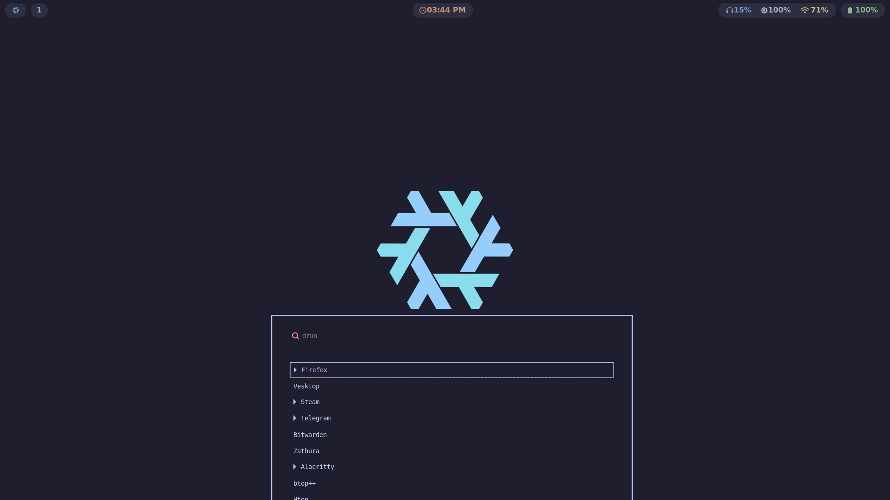

# NixOS.conf
My configuration for NixOS





## Installation:

1. **Install NixOS**: If you haven't already installed NixOS, follow the [NixOS Installation Guide](https://nixos.org/manual/nixos/stable/#sec-installation) for detailed instructions.

2. **Clone the Repository**:

    ```bash
    git clone https://github.com/Nyavielle/NixOS.conf
    cd NixOS.conf
    ```

3. **Use the disko utility to partition your disk, either with your own config or by choosing one of the [example](https://github.com/nix-community/disko/tree/master/example) setups**: (skip this step if you use NixOS already)
    
    ```bash
    sudo nix --experimental-features "nix-command flakes" run github:nix-community/disko/latest -- --mode destroy,format,mount ./disko.nix
    ```

4. **Copy one of the hosts configuration to set up your own**:

    ```bash
    cd hosts
    cp -r LatitudeE5570 <your_hostname>
    cd <your_hostname>
    ```

5. **Put your `hardware-configuration.nix` file there**:
    
    ```bash
    cp /etc/nixos/hardware-configuration.nix ./
    ```

6. **Edit `home-manager/home-packages.nix` and `modules/` files if needed**:

    ```bash
    vim home-manager/home-packages.nix
    ```

7. **Finally, edit the `flake.nix` file**:

    ```diff
    ...
      outputs = { self, nixpkgs, home-manager, stylix, nixvim, ... } @inputs:
      let
    --  user = "Nyavielle";
    ++  user = "<your_username>";
    
        hosts = [
    --    { hostname = "LatitudeE5570"; system = "x86_64-linux"; stateVersion = "25.05"; }
    ++    { hostname = "<your_hostname>"; system = "<your_architecture>"; stateVersion = "<your_stateVersion>"; }
        ];
    ...
    ```

8. **Rebuilding**:

    ```bash
    cd nixos-config-reborn
    git add .
    nixos-install --flake ./#<hostname>
    # or nixos-rebuild switch --flake ./#<hostname> if you use NixOS already
    ```

## Thanks to the people whose code is included in my project:

- [Andrey0189](https://github.com/Andrey0189), for the structure and some functions that I borrowed from his [nixos-config-reborn](https://github.com/Andrey0189/nixos-config-reborn).
- [Srinath10X](https://github.com/Srinath10X), for the waybar [config](https://github.com/Srinath10X/catppuccin-waybar/blob/main/waybar/config.jsonc) and [theme](https://github.com/Srinath10X/catppuccin-waybar/blob/main/waybar/style.css).
- [quantumfate](https://github.com/quantumfate), for the wofi [theme](https://github.com/quantumfate/wofi/blob/main/src/mocha/style.css).
- [catppuccin](https://github.com/catppuccin), for the beautiful color theme.

And special thanks to the NixOS project and the Nix community for providing an amazing system and powerful tools that make configuration a joy~
